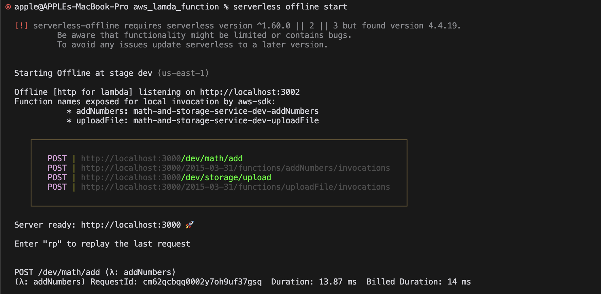
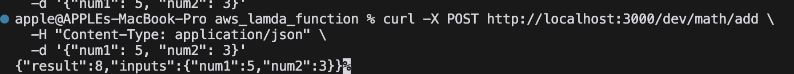

# AWS Lambda Function Project

## Overview

This project is an AWS Lambda function designed to handle file uploads to an S3 bucket. It utilizes the AWS SDK for JavaScript and the Serverless Framework for deployment and local development.

## Features

- Upload files to an S3 bucket.
- Handle file uploads via HTTP requests.
- Support for various file types.

## Prerequisites

- Node.js (version 14.x or later)
- AWS CLI installed and configured
- Serverless Framework installed globally

## Installation

1. Clone the repository:

   ```bash
   git clone https://github.com/ravix007/aws_lambda_function.git
   cd aws_lambda_function
   ```

2. Install dependencies:

   ```bash
   npm install
   ```

3. Configure AWS credentials:
   - Run `aws configure` to set up your AWS Access Key ID and Secret Access Key.

## Configuration

- Update the `serverless.yml` file with your specific AWS settings, including the S3 bucket name.

## Usage

### Local Development

To run the function locally, use the Serverless Offline plugin:

```bash
serverless offline start
```

### Uploading a File

You can upload a file using `curl`:

```bash
curl -X POST http://localhost:3000/dev/storage/upload \
  -H "Content-Type: application/pdf" \
  -H "file-name: raviresume.pdf" \
  --data-binary @./sample.pdf
```

### Testing the Add Function

You can test the addition function using `curl`:

```bash
curl -X POST http://localhost:3000/dev/math/add \
  -H "Content-Type: application/json" \
  -d '{"num1": 5, "num2": 3}'
```

This command sends a POST request to the `/dev/math/add` endpoint with JSON data containing two numbers to be added.

##Screenshot of working code from terminal



